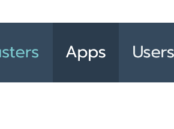
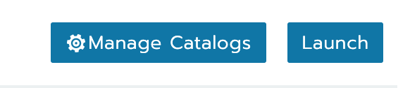
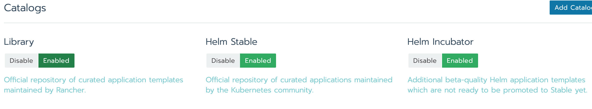

# App guides

After the cluster is up and running, you can install apps using the Rancher UI.  

Click on the `Apps` menu item

Then choose `Manage Catalogs`

Make sure to enable the Helm catalog.

---

From the catalog, we will install the following apps:

- [Prometheus & Grafana](monitoring.md)
- [Docker registry](docker-registry.md)
- Drone CI
