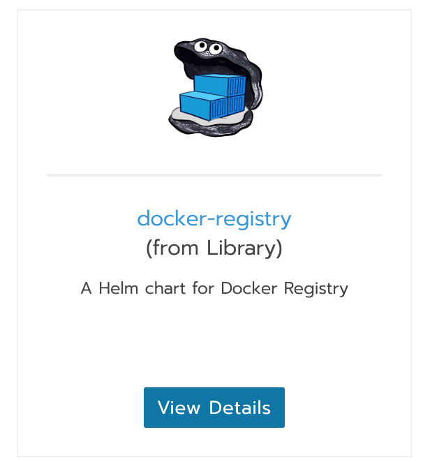
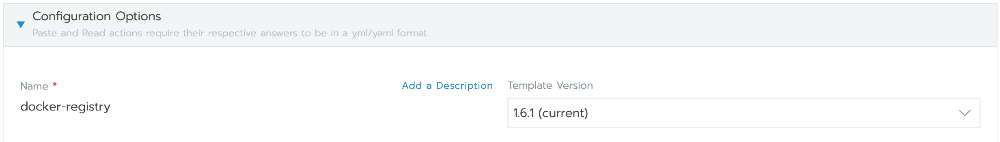
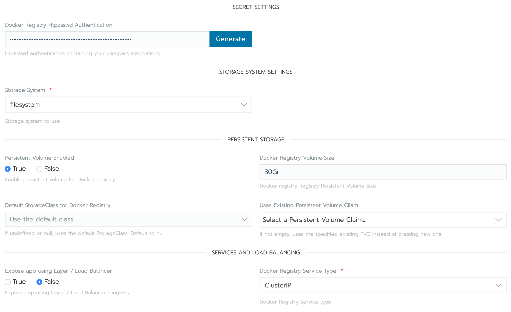
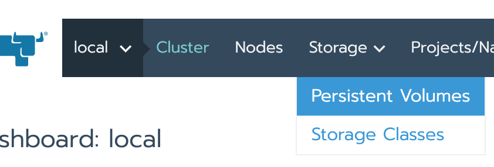
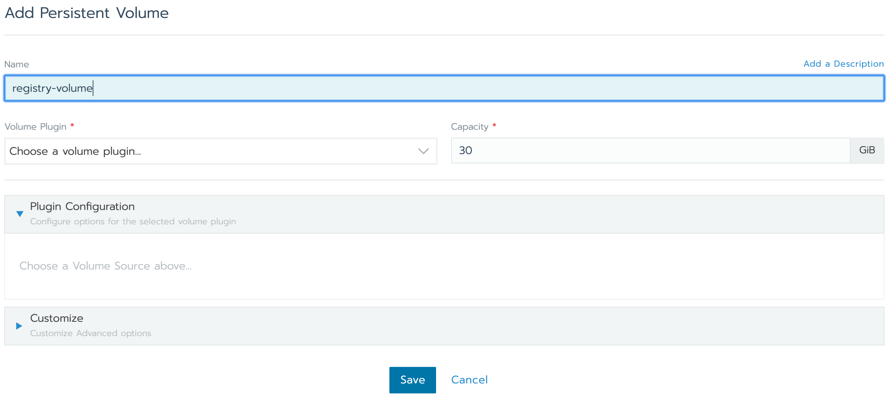

# Docker Registry

To create a private registry inside the cluster, browse the apps catalog and find the `Docker Registry` app. Make sure you are using the chart **from Library**.



You will be presented with the configuration options.



First we setup basic auth. Create a user/pass with `htpasswd`.

```
$> htpasswd -Bbn user password
user:$2y$05$MafeuUzA1PqzVi1czGSaleIcuciqufiv3uYmEqK9ReA2yeKYozq7K
```

And paste that in the `Docker Registry Htpasswd Authentication` field.



Enable Persistent Volume and set the volume size appropriately. You will need to have set up a storage provider (see [this](storageos.md) guide) and choose the appropriate `StorageClass`.  
We will manually add an ingress later, so we disable the load balancer option and set the service type to `ClusterIP`.

Next, in your cluster dashboard, go to `Storage > Persistent Volumes`.



And set the size and name of the Volume to be used by the registry.



Now create an ingress for the registry. Fill in with the appropriate namespace and service name (in this example, `docker-regisry-p3nqs`)

```yaml
# registry-ingress.yml
apiVersion: extensions/v1beta1
kind: Ingress
metadata:
  name: docker-registry
  namespace: docker-regisry-p3nqs
  annotations:
    certmanager.k8s.io/cluster-issuer: letsencrypt-prod
    kubernetes.io/ingress.class: "nginx"
    nginx.ingress.kubernetes.io/proxy-body-size: 50m
  labels:
    app: docker-registry
spec:
  tls:
  - hosts:
    - your.hostname.com
    secretName: docker-registry-tls
  rules:
  - host: your.hostname.com
    http:
      paths:
      - path: /
        backend:
          serviceName: docker-regisry-p3nqs
          servicePort: 5000
```

```
$> kubectl apply -f registry-ingress.yml
```
