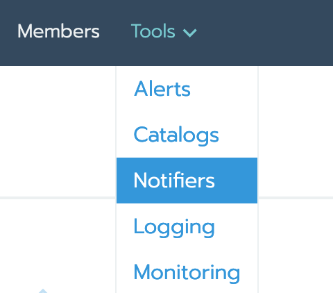
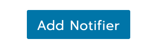
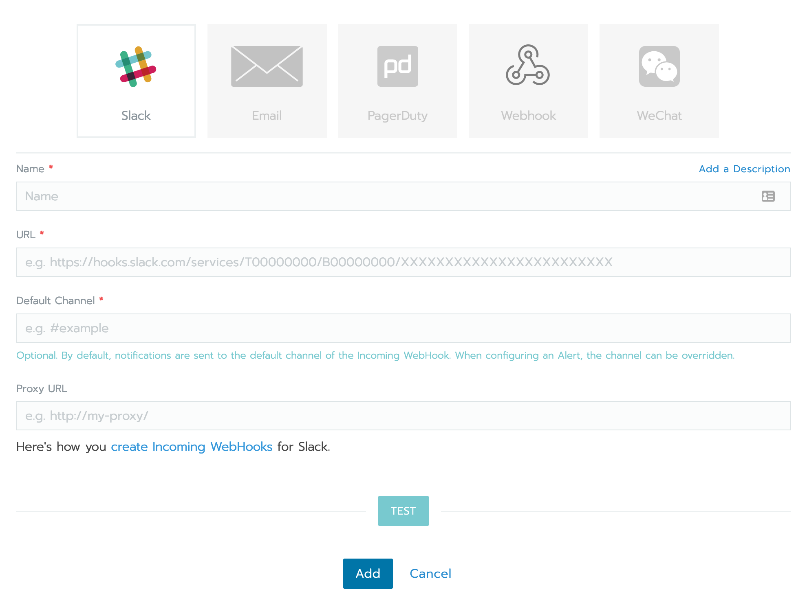

# Prometheus & Grafana

To enable monitoring, select your cluster (`local` in this example).

Click on the `Tools` tab, and choose the `Monitoring` item.

You will be presented with the configuration options for Prometheus and Grafana. The defaults are reasonable.

Click on `Save` and you should be able to see the monitoring dashboard after clicking on the `Cluster` tab.

You can also go directly to Grafana.

Setting up alerts is also easy, we will show how to enable them for Slack.

First, create a notifier by selecting your cluster (once again, `local` in this example), then the `Tools` tab and then `Notifiers`.

Click `Add notifier` and provide name, a webhook url, a default channel and a proxy url if you're behind one.

You can click on the `Test` button to make sure it works; once it's done simply navigate to the `Alerts` menu in the `Tools` tab to start adding `Alert groups` and `rules`. Alert groups are associated to a notifier, so that every rule in the group uses it. 
