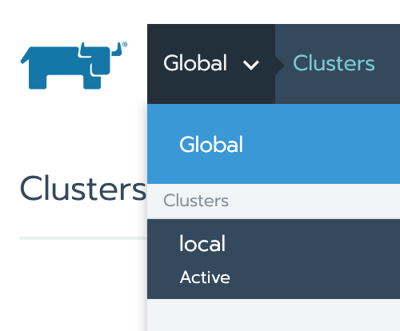
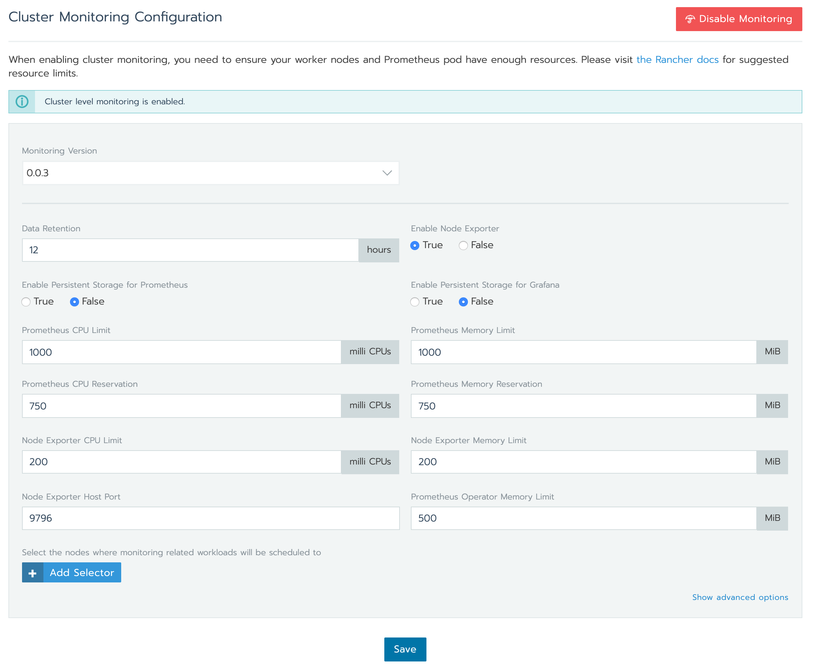
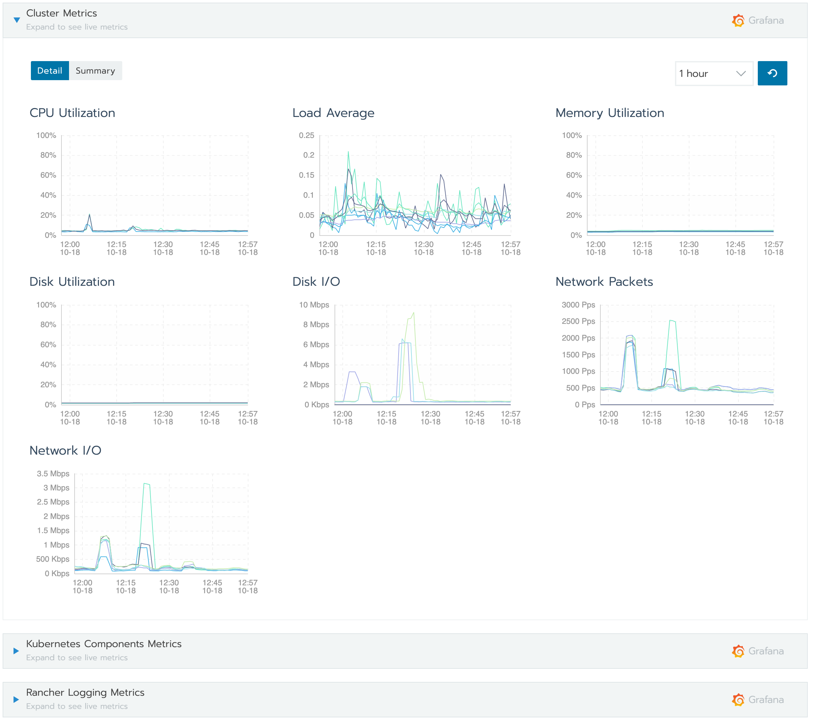
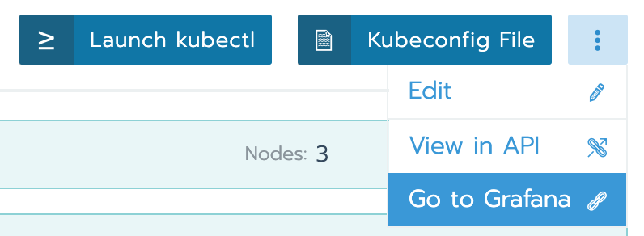

# Prometheus & Grafana

To enable monitoring, select your cluster (`local` in this example).

Click on the `Tools` tab, and choose the `Monitoring` item.

You will be presented with the configuration options for Prometheus and Grafana. The defaults are reasonable.

Click on `Save` and you should be able to see the monitoring dashboard after clicking on the `Cluster` tab.

You can also go directly to Grafana.

