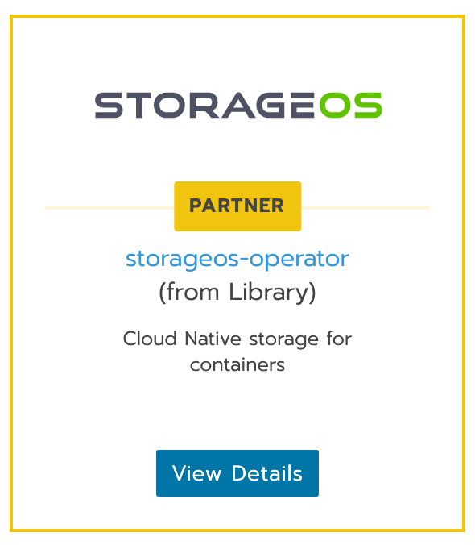
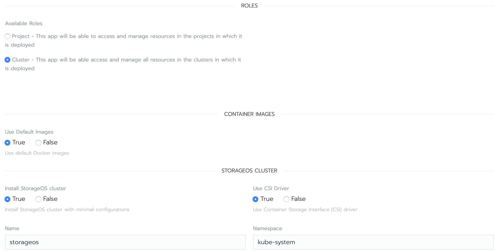
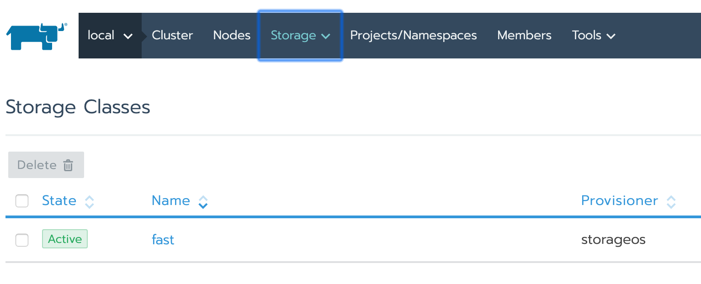

# StorageOS

> StorageOS is a cloud native, software-defined storage platform that transforms commodity server or cloud based disk capacity into enterprise-class persistent storage for containers.



Click on `View Details` and you will be shown the configuration options. Make sure the app is available **across the cluster** and choose an appropriate name.



After the app is installed, you should see a `StorageClass` named `fast` when you browse to `Storage > Storage Classes` in your cluster view page.



We will also make two `StorageClasses` for replicated volumes, to allow for dynamic volume creation with one and two replicas.

```
$> kubectl apply -f apps/storageos/storage-classes.yml
```
